System is an inherent component, which cannot be deleted and don’t need to add.
System is used to implement some system level conditions and actions.

#### Quick Links
|System Conditions||
| ------: | :------ |
|system|[per frame](#per frame：)，[per X second](#per X second：)|
|General|[Two value comparison](#Two value comparison：)，[

two values](#between two values：)，[If the value is a number](#If the value is a number：)，[Global variable comparison](#Global variable comparison：)|
|instance obtain|[Obtain any instances](#Obtain any instances：)，[obtain all instances](#obtain all instances：)|

|System Actions||
| ------: | :------ |
|system|[create instance](#create instance：)，[Jump to front/back scene](#Jump to front/back scene：)，[jump to specifed scene](#Jump to specified scene：)|

------------

### System Conditions：
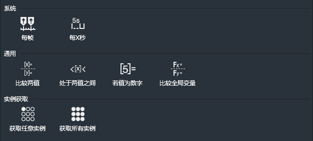

#### Per Frame：
It’s triggered when every frame update of game.【continuous trigger】
The default frame value of Lakeshore is 60fps, which is 60 frames per second, and trigger 60 times per second. And this condition is true as long as the game runs.
This condition has no property settings window.

#### Per X Second:
It’s triggered one time per X second.【continuous trigger】
It’s triggered one time per X second from the game starts running.
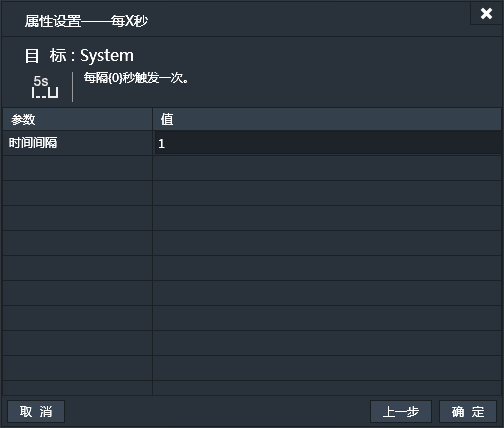

#### Two Values Comparison：
It’s triggered when comparison result is true in two values comparison.【continuous trigger】
Fill in value or expression, then the select comparison operator. Generally they are used to compare variables. For example, the comparison between instance boss.x (X-axis coordinates expression of the boss instance) and hero.x (X-axis coordinate expression of the hero instance). It’s triggered if boss.x value is greater then hero.x.
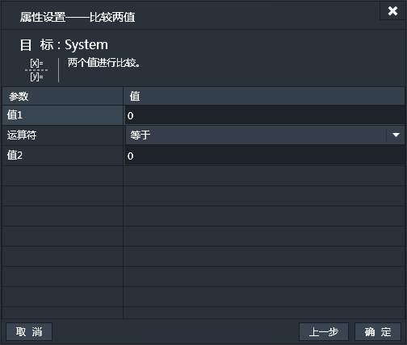

#### Between two values：
If the specified value is between the specified large and small value, the condition is true and it’s triggered.【continuous trigger】
Fill in separately the specified, small, and larger value, and judge whether the specified value is between large and small value.
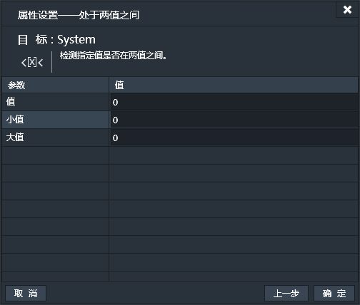

#### If value is a number：
If the specified value is a number and condition is true, then it’s triggered. 【continuous trigger】
You can fill in value, variable name or expression, which is used to judge the input content’s value is number or not.
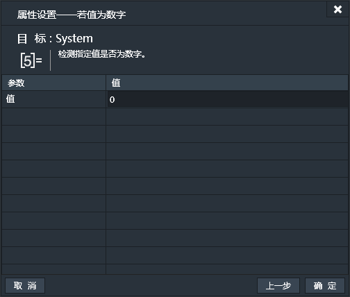

#### Global variable comparison ：
Select a global variable to compare with the selected value, if the condition is true and it’s triggered. 【continuous trigger】
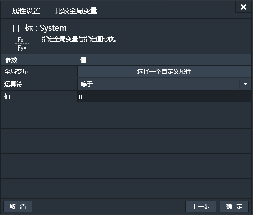

#### Obtain any instance：
Select one of the same type instance from the specified instance type, if the condition is true then it’s triggered.【continuous trigger】
Implemented action based on this condition are only valid for the obtained instance. For example, there are 10 instances of the same instance type, and the action only operate on one of them.
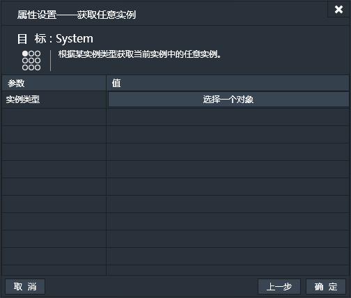
#### Obtain all instances：
Obtain all of specified instance type, if it’s successful then it’s triggered. 【continuous trigger】
Implemented action based on this condition are valid to all of instance type. For example, there are 10 instances of the same instance type, and the action operates on 10 instances all.
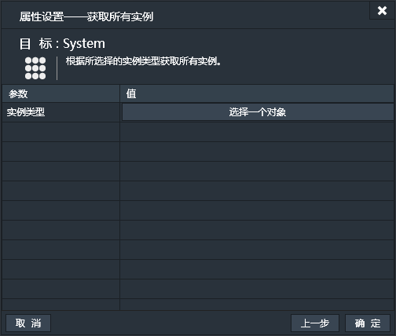

------------

### System Actions：

#### Create Instance：
The specified instance is generated by the system creation. Instance of creation and specified instance are same type instance.
 - Instance: select the instance you want to create.
 - Layer serial number: set the layer where the created instance is located, and it’s specified by the layer serial number.
 - landscape coordinate：This is the landscape coordinate based on the scene.
 - Portrait：This is the portrait coordinate based on the scene.。

Here is a simple explanation, creation is just like creating something out of nothing.
For example, in Fighting Plane game, there are enemy aircraft continuously flying into the screen form the upper edge, and these enemy plane are generated by system through creation actions. They are the same instance type.
The difference from the general action “manufacturing” is that “creating” is acted by system and is a system-specific action.
However, the “manufacturing” is acted by one instance, and it’s a general action of an instance, such as aircraft shot bullet, here the plane is the instance that implement a “manufacturing” action, and the bullet is the instance that’s created by “manufacturing”.

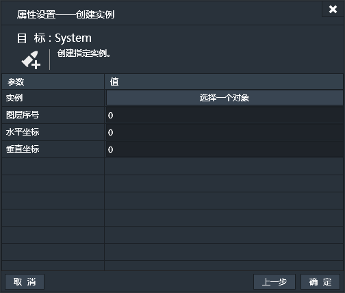

#### Jump to front/back scene：
Jump to the previous or next scene in the game.
We don’t need to specify the previous/next scene name, system will jump based on the scene sequence of the game itself.
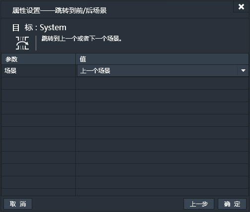
#### Jump to specific scene：
If you want to jump to the specified scene in game, you need to specify its name.
If your specified scene is the current scene, the jump function is equivalent to resetting current scene.

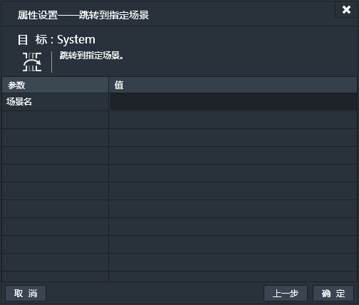