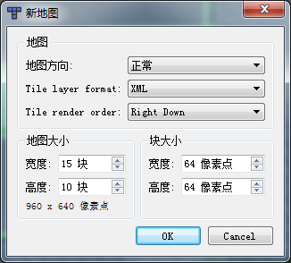
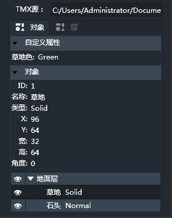

The Tiled component is used to add and edit game Map files using the Tiled Map Editor.
Lakeshore is currently only able to call and parse TMX Map files produced by Tiled Map Editor and does not provide editing of TMX Map files.

Tiled Map Editor address：[http://www.mapeditor.org/](http://www.mapeditor.org/) 

It saves the map as an XML file, and makes the map universal to various game platforms with the help of XML features. Currently, Lakeshore only supports maps edited with the map direction in normal mode (normal mode is 90 degrees), as shown below:

In addition, Lakeshore currently only supports the display of map block data, but not the display of terrain data, as shown below:

------------

###  Tiled Map Properties

After adding the TiledMap component, click the "TMX source :" input box in the TiledMap property panel, find and specify the TMX file to be loaded in the popup file search window, and then the TiledMap map can be loaded. The diagram below:

*Note 1：It is recommended to save the TMX file edited by tiled software and the image files used in it to the other folder under the current project project folder.Otherwise the map may not display because of security zone.

*Note 2：Tiled components do not support collisions.

After importing the TMX file, the object panel of the TiledMap property bar will display the content of the object layer in the TiledMap Editor, as shown below:

Similarly, the layer content in the Tiled Map Editor will also be rendered in the layer palette, where the corresponding layers can be set to show and hide. The diagram below:

------------

### Tiled Conditions
Tiled components do not support any conditions.

------------

### Tiled Actions
The TIled component does not support any actions.
