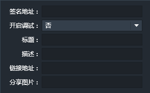
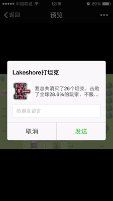
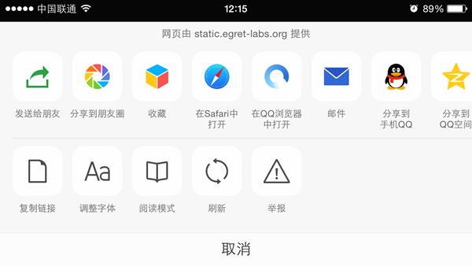
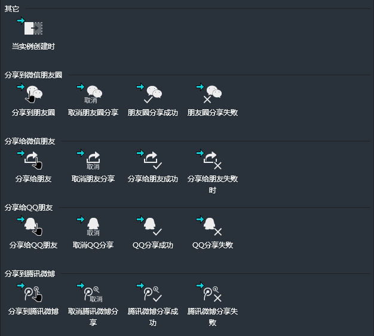
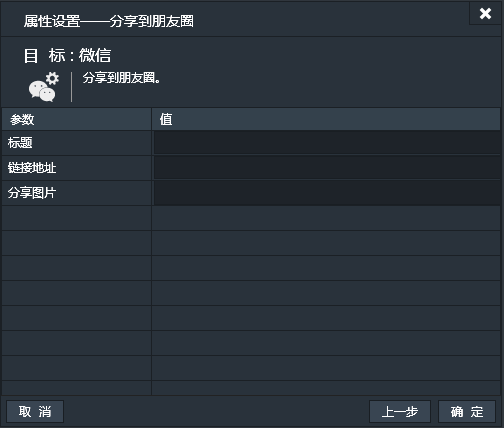
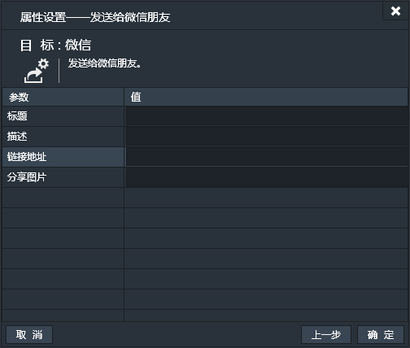
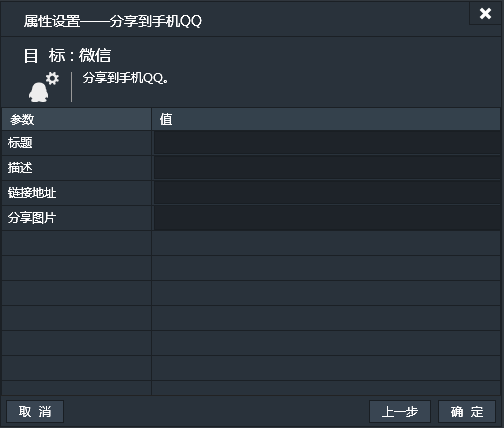
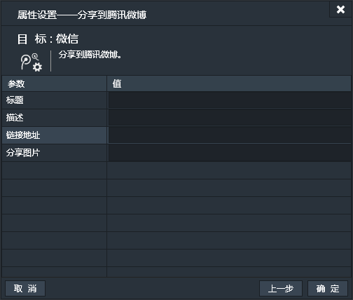
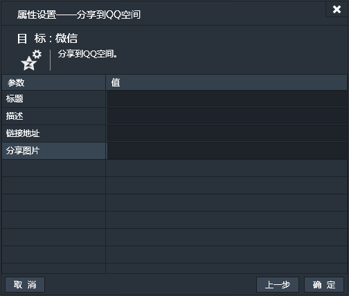

After adding WeChat component, the game can realize WeChat sharing function.
*Note: the WeChat component does not support any basic properties other than "name". Collision is not supported. WeChat components are added without generating a visible instance in the game run scene.

### Specific Attribute

- signature address: the URL of the server-side generated signature address. This address is the Json data address of the signature information generated by the server, and the Json data content is similar to the following representation:

```
{"appId":"wx13c6ec9ac5ca884e","timestamp":1441508912,"nonceStr":"bljssdk","signature":"5256549a4aeca9187dc52f119d65ef622e21353e"}
```

Please refer to the official WeChat document for specific information：[WeChat js-sdk documentation](http://mp.weixin.qq.com/wiki/7/aaa137b55fb2e0456bf8dd9148dd613f.html)
- turn debugging on: default value is "no". If "yes" is selected, it means that when the mobile terminal previews the WeChat share, whether the WeChat signature is valid or not, and the address of the picture information at the time of sharing will be displayed in the pop-up dialog box. After the general debugging is passed, it will be set as "no" to close the debugging.
- share title: WeChat share title that needs to be displayed when sharing.
- description: WeChat share needs to show the Shared content.
- link address: WeChat share after click to share the content will jump to the address.
- share pictures: WeChat share icon files displayed after.

Below is the game WeChat to share the display effect on the mobile terminal:

In the figure above

- "Lakeshore fights tanks" corresponds to "title" in the specific attribute.
- "I destroyed a total of 26 tanks... "Corresponds to description in a specific attribute. In addition to filling in the fixed static content in the special properties panel, this part of the content can also fill in the expression in the special action of WeChat to achieve dynamic content. See the WeChat action below.
-  the tank icon corresponds to "share picture" in the unique attribute.

------------


###  WeChat Conditions
The WeChat component does not support generic conditions other than unique and "when the instance is created" conditions.

WeChat condition corresponds to some feedback information when users operate WeChat to share.

In the figure above, when the user clicks "send to friends", the condition "share to friends" will be triggered. Similarly, when the user clicks "share to circle of friends", the condition "share to circle of friends" will be triggered.
With these conditions, you can be more flexible to do some wechat sharing logic, for example: we can add functions such as only WeChat sharing can enter the next level in lakeshore level games, or WeChat sharing can send some rewards and so on.



**The following conditions have no property setting window. **
**The following conditions are [one-time trigger]**
**Because WeChat condition is relatively similar, the name has explained the function, so I do not make specific description.**

- share to WeChat friends circle
 - share it with friends
 - cancel sharing in moments
 - share success in the circle of friends
 - failed to share in the circle of friends
 - share it with WeChat friends
 - share it with friends
 - cancel friend sharing
 - share success with friends
 - share failures with friends
 - share to QQ friends
 - share to QQ friends
 - cancel QQ sharing
 - qq share success
 - QQ share failed
 - share to tencent weibo
 - share to tencent weibo
 - cancel tencent weibo sharing
 - tencent weibo share success
 - tencent weibo failed to share

------------


### Micro Letter Action
The WeChat component does not support any generic actions other than specific actions.

Title and description support expressions in WeChat actions. In this way, dynamic information in the game can be Shared to the mobile terminal. For example, the description information could be written as follows:

```
'我总共消灭了'+eval(gameover.tank1+gameover.tank2+gameover.tank3+gameover.tank4)+'个坦克，'+'击败了全球'+eval(((gameover.tank1+gameover.tank2+gameover.tank3+gameover.tank4)/91*100).toFixed(1))+'%的玩家，不服来战！！'
```

This way, the Shared information can show the results of the game.
*Note: expressions offered in Lakeshore that are purely expressions, such as 1+2+3, can be expressed without eval, whereas mixed characters, such as' I totally destroyed 'above, need to be expressed in eval.


#### Share to friend circle
- share title: WeChat share title that needs to be displayed when sharing.
- link address: WeChat share after click to share the content will jump to the address.
- share pictures: WeChat share icon files when displayed


#### Send it to WeChat friends
- share title: WeChat share title that needs to be displayed when sharing.
- description: WeChat share needs to show the Shared content.
-  link address: WeChat share after click to share the content will jump to the address.
- share pictures: WeChat share icon files displayed after.


#### Share to mobile phone QQ
- share title: WeChat share title that needs to be displayed when sharing.
- description: WeChat share needs to show the Shared content.
- link address: WeChat share after click to share the content will jump to the address.
- share pictures: WeChat share icon files displayed after.


#### Share to tencent weibo
- share title: WeChat share title that needs to be displayed when sharing.
- description: WeChat share needs to show the Shared content.
- link address: WeChat share after click to share the content will jump to the address.
- share pictures: WeChat share icon files displayed after.


#### Share to QQ space
- share title: WeChat share title that needs to be displayed when sharing.
- description: WeChat share needs to show the Shared content.
-  link address: WeChat share after click to share the content will jump to the address.
- share pictures: WeChat share icon files displayed after.




