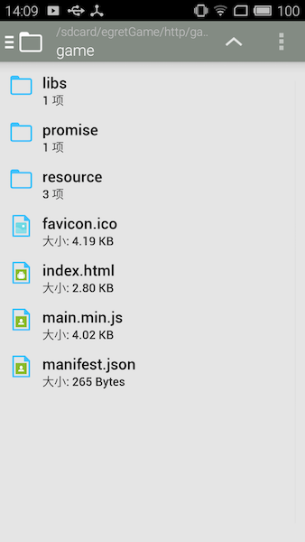

## Current File Caching Policy

Files downloaded during game running will be cached locally, refer to "native caching strategy".

When you package an application, you can put your game resources into a package. The launcher creates a native project that automatically publishes egret projects to the assets directory. You can repackage the project if you want to update it, or manually replace the resource.

Native can specify the preload directory through config.preloadpath. The runtime will first look up the file from this directory when loading the resource. If it cannot find the file, it will look it up under assets directory or download it from the server.

Find the priority of resources: pre-loaded directory > local resources (resources under assets)> cache directory (resources dynamically downloaded during game operation).

## API Specification

By modifying config.preloadpath to specify a preloaded directory, developers need to maintain the contents of this directory themselves.

```
Android:
//MainActivity.java
nativeAndroid.config.preloadPath = "specified directory";

iOS:
//AppDelegate.mm
_native.config.preloadPath = "specified directory";
```

 Absolute paths to begin and end with "/", e.g. "/sdcard/egretGame/"

A simple way to think about it is to deploy the game to a directory on your phone and then open the game in that directory. When you need to update a resource, you just need to update the corresponding resource in the directory.

## File Location

The storage location of file is corresponding to its url, eg: the corresponding local file path of "http://game.com/game/index.html" is config.preloadPath+"http/game.com/game/index.html".

If all resources are local, the game address may not be a real address.

Get the root directory (where index.html resides) path reference method

```java
String getFileDirByUrl(String urlString /*"http://game.com/game/index.html"*/) {
    int lastSlash = urlString.lastIndexOf('/');
    String server = urlString.substring(0, lastSlash + 1);
    return server.replaceFirst("://", "/").replace(":", "#0A");
}
```

## Matters Needing Attention
1. Note to apply for file read and write permissions when the preloaded directory on Android is set to the directory on the sd card.
2. For projects packaged with iOS Hybrid solution, please refer to the update strategy and demo in "how to use Hybrid".
3. Query is ignored when loading preloaded resources (query with game address can be read in the game, but cannot be versioned with query).

## Example Project Description
The sample project shows how to download the game resources to the preloaded directory and start the game from the preloaded directory.

Address: http://game.com/game/index.html (not real address, for the use of the game logic)

 The game resources address: http://tool.egret-labs.org/Weiduan/game/game2.zip (a HelloWold engineering)

In Android, for example, after completion of decompression/sdcard/egretGame/http/game.com/game/ content is as follows:



Once the game resource is unzipped, set config.preloadpath to specify the preload directory from which the runtime will first load the resource when the game is started.

### Download Sample Project

[Android](http://tool.egret-labs.org/DocZip/native/demo_android_preload.zip)

[iOS](http://tool.egret-labs.org/DocZip/native/demo_ios_hotupdate.zip)

The sample project shows only the basic methods of preloading game resources and does not handle abnormal events such as download failure.
