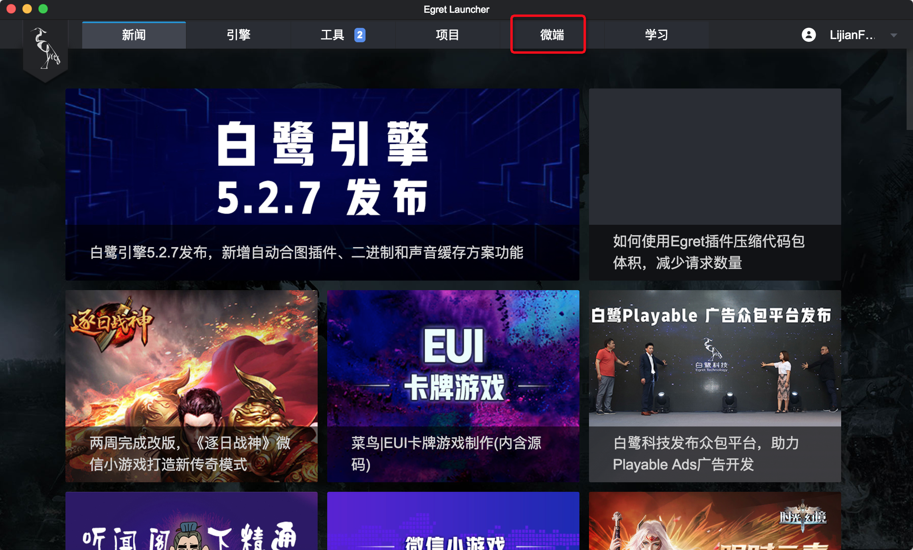
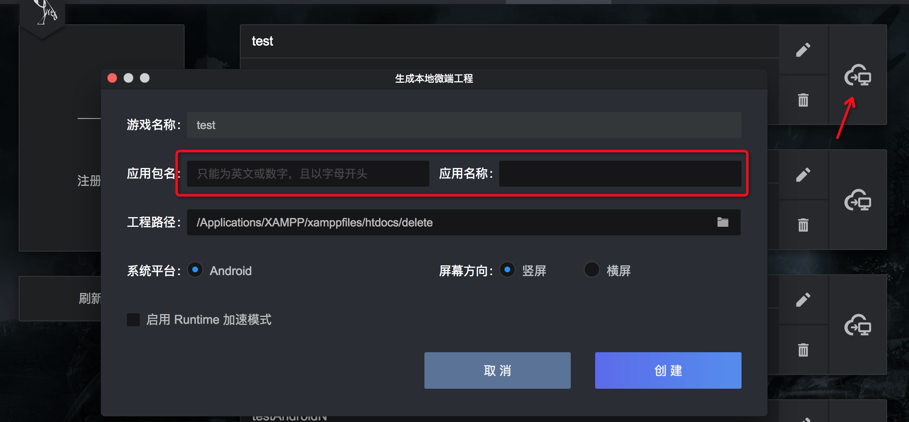
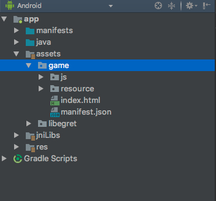

## What is a MicroClient

Egret MicroClienticroClient is a packaging solution launched by the Egret team to solve the Egret native APP package size problem.

Through dynamic loading technology, egret micro terminal can guarantee that the native APP package released by packaging is very small, so as to save the cost of game promotion and improve the retention rate of game users.

Egret micro terminal has two built-in operation modes, Runtime mode can greatly improve the performance of the game developed based on Egret engine, while Webview mode can maximize compatibility and support HTML5 games developed by other game engines.

**MicroClient only supports the release of Android projects.**

##  Create MicroClient projects

- Enter the MicroClient interface



- Register the game, fill in the name and address of the game


- Create Android project, fill in application registration and application name



- Choose whether to use Runtime acceleration according to requirements. If not checked, the game will be loaded through WebView. The advantages and disadvantages of the two modes are as follows:


## Using Local Resources

The resources used by the micro end are loaded from the network by default. Starting from v0.0.13, the resources can be packaged in the app.

Use local resources or want to package H5 games into the micro terminal,Simply copy the h5 published project directly into the assets/game directory. If you do not have this directory, please create it.



## JS Communicates with Java

The logic is the same as Android Native, except that the apis for Native projects are different.

How to register to receive messages:

```java
launcher.setExternalInterface("sendToNative", new INativePlayer.INativeInterface() {
    @Override
    public void callback(String s) {
        Log.d("Egret Launcher", s);
    }
});
```

Send message:

```java
launcher.callExternalInterface("sendToJS", "message from microclient");
```

## Start page

### Method to manually close the startup page

When the game page opens, the micro terminal automatically closes the startup page by default.But when you have a lot of js files or other files loaded into your page,Because these files need to be read from the network or local cache, there is a period of black screen time. It's not a good user experience for the player.

So we also provide a way to manually close the startup page. In this mode, the startup page persists until the code to close the startup page is invoked.

- Set up the android project

Android project MainActivity

```
//1 is auto close and 0 is manual close
launcher.closeLoadingViewAutomatically = 1;
```

Change **=1** in the code to **=0**

- Modify the game code

When your game is ready to close the startup page, call this code

```
if (window['closeLoadingView']) {
    window['closeLoadingView']();
}
```

- Optimization Suggestions

The amount of time that the black screen waits is proportional to the number of files that are loaded,Even if you manually close the startup page, it can take a long time for the player to wait. Therefore, it is recommended to combine js quantity.For example, if you use egret publish, you can merge hundreds of js files into one, and egret egret publish will egret publish at a great speed.

### Disable the Startup Page Method

MicroClient 0.1.8 was added. The startup page will no longer pop up when disabled.

```
launcher.disableLaunchPage();
```

### Method to Modify the Boot Page Address

MicroClient 0.1.8 was added.

```
launcher.launchPageUrl = "launcher page address ";
```

## Use the Startup Diagram in the MicroClient

In order to solve the problem of poor white-screen experience before the application starts, an image will be displayed first and then turned off after the application starts. This method is also available in MicroClients.

### [Sample demo download address](http://tool.egret-labs.org/microclient/doc/zip/launchimageAndroidV1.2.zip)

### The Meaning of the Startup Diagram

The startup diagram can reduce the possibility of black screen, white screen or flower screen that users see, and make the startup process of the APP more natural and bring better experience to users.

### How to Use the Startup Diagram

Enable the startup diagram function through the initViews method of the NativeLauncher class. The prototype function is as follows:


```
public void initViews(FrameLayout layout, int imageResId, int duration);
```

Where layout represents the root node of the View,ImageResId represents the image resource id of the startup diagram, while duration represents the time of the startup diagram display in milliseconds.If this time is equal to 0, it means that the startup diagram will close itself after the game starts.If it is greater than 0, the startup diagram closes after that time.

For example, suppose you have an image called background.jpg in your drawable directory under the res folder,The image is used for the startup diagram and the startup diagram is displayed for 2 seconds, so the sample code is as follows:


```
launcher.initViews(rootLayout, R.drawable.background, 2000);
```

The launcher is from the NativeLauncher class,RootLayout is the root node of the View,R.rawable. Background refers to the background-jpg image in front of it. 2000 indicates that the display time is 2 seconds.

## Other Project Settings

### Whether to Redownload the Game Every Time it Starts

This feature is used for debugging purposes. The default value is 0 and set to 1 to clear the download cache before each boot.

```java
launcher.clearGameCache = 0;
```

### Timeout Time for Loading Index

Sets the timeout for loading index. The default value is -1 and no timeout is set.

```java
launcher.loadingTimeout = -1;
```

### Set the Preload Path

See "description of hot update scheme" for details.

```java
launcher.preloadPath = "";
```

### Disable Native Rendering Acceleration

Runtime automatically turns on native render acceleration if the engine version is appropriate. If you don't want to use this feature, you can turn it off in the project.

```java
launcher.disableNativeRender();
```

###  Set Webview Transparency

In setExternalInterfaces (); Add a line of code:

```java
launcher.setWebViewBackgroundTransparent(true);
```
