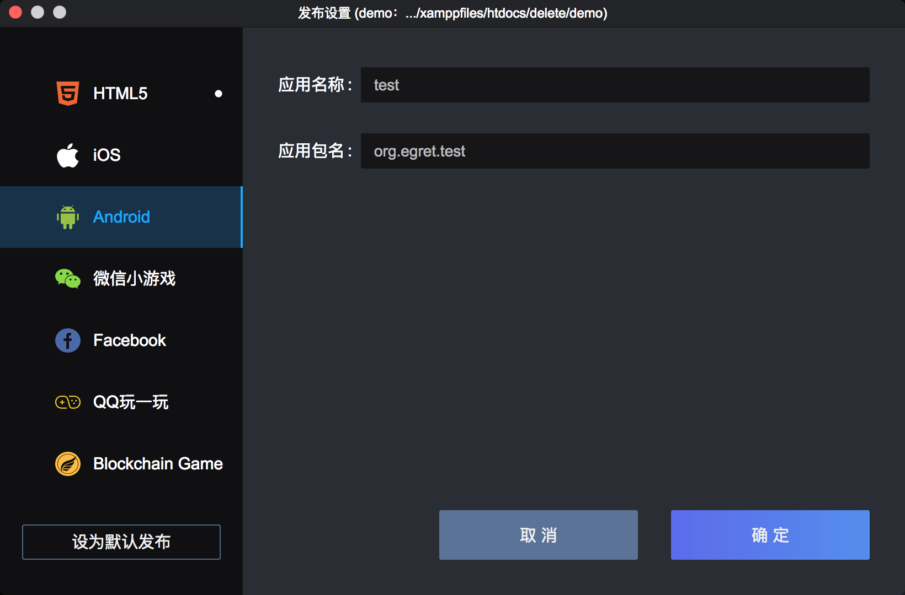
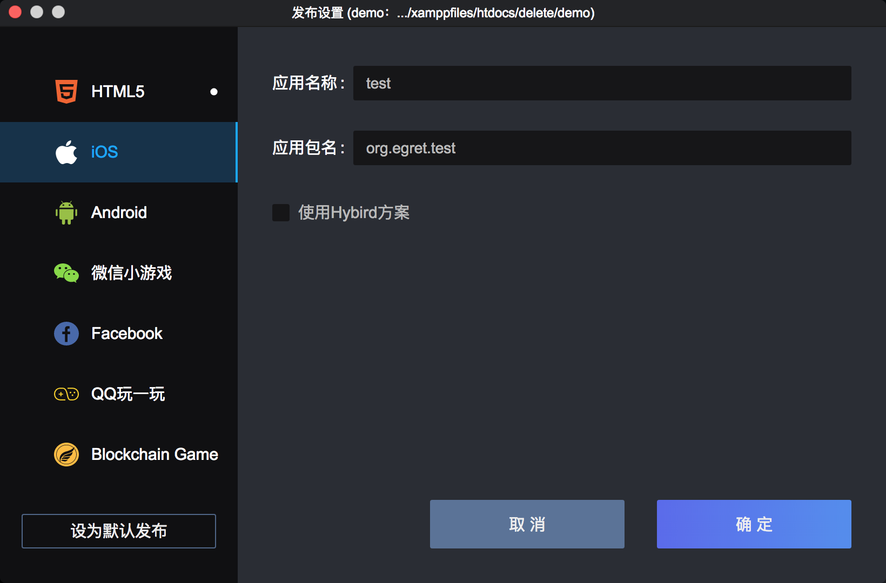

Through ` Egret ` engine game, not only can be released into ` HTML 5 ` web project, also can be released into the original project.

## Preparation Before Publishing Settings

- Install the latest version of launcher
- Confirm engine version
    - Engine version must be***5.1.6 or above***
- You need to install Xcode to release iOS
    - recommended version: 9.0 or above
    -  Later, modification and function access of the publishing project need to be completed in Xcode
-  Android needs to be installed on Android
  - Recommended version: 3.0 or above
  - Later, modifications and functional access to the release project need to be completed in Android Studio

## Release Android Project

### Publish the Project

- In the launcher's project palette, find the Egret project that you want to publish your Android project, and click on the publish Settings


- Click the Android button on the left, enter the application name and application package name on the right page, and click ok.




## Release iOS Project

### Publish the Project

- In the launcher's project palette, find the Egret project that you want to publish your iOS project, and click on the publish Settings


- Click the iOS button on the left, enter the application name and application package name on the right page, and click ok.



-  If checked `using Hybrid scheme`，the project will use iOS webview to run the game

## Project Settings

### Set the Game Address
Android：

```java
nativeAndroid.initialize(gameUrl);
```

iOS:

```objective-c
[_native startGame:gameUrl];
```

The launcher creates a default project that places the game resources under the assets/game directory and loads the game from the assets directory. If you do not need to put the game into the app, delete the assets/game directory.

### Other Settings

Engineering Settings can be changed by modifying the properties of nativeandroid.config or _native. Config.

Property description:

- whether the FPS panel is displayed in showFPS
- FpsLogTime log the amount of time spent on the screen in seconds, minus 1 for permanent display
- DisableNativeRender disable native rendering acceleration
- If clearCache clears the cache, set to true to clear the cache every time it is started for debugging
- LoadingTimeout load index timeout. The default is 0 and no timeout is set
- PreloadPath sets the preload directory. See "hot update scheme description" for details.

## 5.1.6 the Following Engine Versions Are Released as Native Projects

5.1.6 the following engine does not support scripts to publish native projects, so it cannot directly publish native projects through launcher.

### The Solution

1. Create a native project with egret of 5.1.6 or greater for the engine version of the launcher.
2. Release games with native apps as h5.
3. Replace the publish results with the native project assets/game directory.

## Pay attention to

Native only supports webgl rendering mode.
