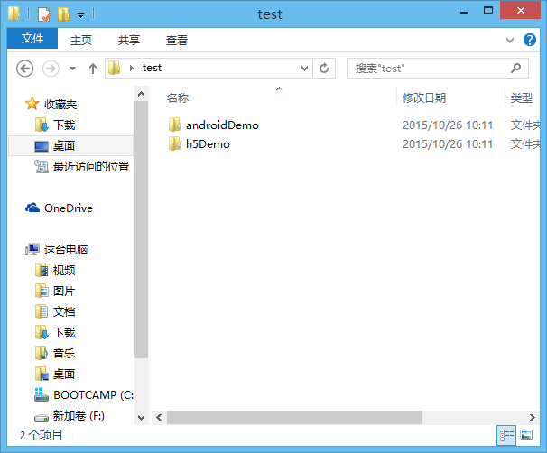
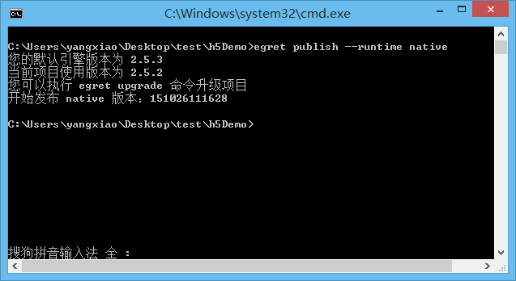
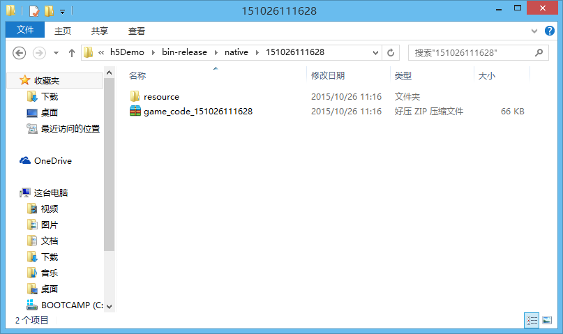

## Introduction

This document is suitable for 2.5.3 or higher version

Egret's packaging projects support hot update on both Android and iOS platforms.

We will illustrate the hot update operations by using Android platform as example in the following content, and you only need to do corresponding configurations and different modifications in iOS entry class code in iOS platform for hot update.

## Perparation

We need to create Android project of Eclipse before a hot update. If you have any doubts about importing Eclipse packaging projects, please refer to the following articles:

- [Packaging Android app](../../../Engine2D/publish/publishAndroid/README.md)
- [Packaging iOS app](../../../Engine2D/publish/publishIOS/README.md)

## Configuration Files
We need to configure egretProperties.json in H5 project before we release a hot update.

Create a Egret H5 project with a name h5Demo in desktop folder test by using Egret Wing

Create a Android project with a name androidDemo in desktop folder test by using `egret create_app` command line.

The final file structure is shown as below:

Open configuration file egretProperties.json in H5, and its file structure is shown as below:

	{
		"native": {
			"path_ignore": [],
			"android_path": "../androidDemo"
		},
		"publish": {
			"web": 0,
			"native": 1,
			"path": "bin-release"
		},
		"egret_version": "2.5.2",
		"modules": [
			{
				"name": "egret"
			},
			{
				"name": "game"
			},
			{
				"name": "tween"
			},
			{
				"name": "res"
			}
		]
	}

For field description, please refer to: [project configuration file description](../../../Engine2D/projectConfig/configFile/README.md) ，and you only need to know  “path_ignore”、“android_path”、“path”.

> android_path is added automatically after executing `egret create_app`

## Android Project Configuration

Use Eclipse to import the androidDemo project and find the entry file androidDemo.java, and you can modify it according to your actual project name.

Here we need to do two modifications:

- Modify the parameter of setLoaderUrl method as 1, it's 2 by default, shown as the figure below:

- Modify the loaderUrl and updateUrl variables with case value as 1 in setLoaderUrl method, shown as the figure below:

  

- case 2, null character string, that means the current package use the data structure after raw format `egret build [-e] --runtime native`.
- default, after the local use zip package `egret publish --runtime native --version xxx`, the latest resource bundle will be copied to the Android project. And you can run a test in Android project.
- case 1, generally it's dynamic address here, it will return the specific json content according to the request content. There will be hot update mechanism only in this way, and the engine will update based on the provided name of game_code.zip.

## Server Setting

It will run a comparsion by requesting a update from the previously set HTTP (loaderUrl)  address in every time App starts.

We also need to build a WEB server, please refer to Google search, there're a lot tutorials.

The server needs to return a specific JSON format:

	{
	"code_url": "http://10.0.5.158/app/151023172200/game_code_151023172200.zip",//game code zip package path
	"update_url": "http://10.0.5.158/app/151023172200" // Game resource storage path
	}

We create a file named egret.php by taking PHP as example, content as shown below:

	<?php
	define('CASE_NAME', '151023172200');
	
	function startsWith($string, $pattern) {
		return $pattern === "" || strrpos($string, $pattern, -strlen($string)) !== FALSE;
	}
	
	$json = array();  //set false if it's not exist;
	if (!startsWith(CASE_NAME, 'http://')) {
		$ip = "http://10.0.5.155/app/";
		$root = $ip  . CASE_NAME ."/game_code_".CASE_NAME. ".zip";
		$update = $ip  . CASE_NAME;
		$json["code_url"] = $root;
		$json["update_url"] = $update;
	} else {
		$json["code_url"] = CASE_NAME;
		$json["update_url"] = dirname(CASE_NAME);
	}
	echo(json_encode($json));

Here the define('CASE_NAME', '151023172200');  is the content needed to be replaced at each time APP update. Let's take a look at the output:

It also could be a json file, as long as the content it returns is in compliance with requirements, there's no restrictions on languages.

## Release Update Version

We need to know the release command: 

	//it's the customized version folder after version, if there isn't such a folder, then system will automatically generate a numeric string folder, but generally it will be omitted.
    egret publish --runtime native --version xxx

Find the directory of h5Demo that we created aforementioned, and execute the release command, shown as the figure below:

h5Demo project will have a bin-release folder after command is executed, in which contains the resources that we need to update, shown as the figure below:

Copy the 151026111628 folder to the specified location on WEB server and modify the constants in egret.php  to complete the update:

    define('CASE_NAME', '151026111628')

What we need is that he final output path of egret.php is able to match the 151026111628 file.

Now we can modify the background file resource/assetsbg.jpg, and execute ` egret publish --runtime native` and update the folder to server, then modify egret.php. And start your APP to see if the background is updated.

> Note: android project might be updated after each time we release a project, here you need to re-set the relative parameters and contents of setLoaderUrl.

## The method of Avoiding auto hot update when first time starting APP (Added in 3.2.4)

Android：

Add properties in getGameOptions and specify local zip package name:

~~~
options.put(EgretRuntime.OPTION_PUBLISH_ZIP, "game_code.zip");
~~~

iOS:

Add properties for _options in runGame, and specify local zip package name:

~~~
options[@OPTION_PUBLISH_ZIP] = @"game_code.zip";
~~~

## The method of displaying GameLoadingView without hot update in advance (added in Android support 3.2.5)

Add the shortest duration time parameters when setting GameLoadingView:

~~~
gameEngine.game_engine_set_loading_view(new GameLoadingView(this), 5); // GameLoadingView will last at least 5 seconds
~~~

## Summary

The hot update mechanism is relatively simple, the basic steps:

1. Modify setLoaderUrl method of Android packaging project entry file and release the offical version APP.
2. Execute `egret publish --runtime native` release command at every time resource or code modification of H5 version.
3. Copy the generated folder to the WEB server and modify the update path in server.
4. Make sure that the name of zip package at each time hot update is different.
