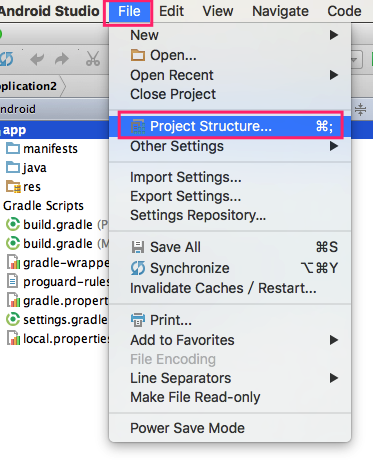
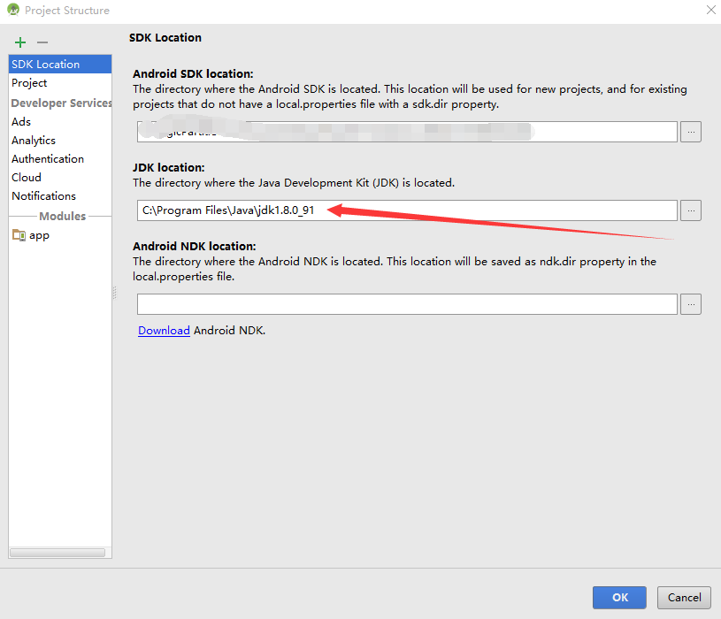

> Android Studio-based Android Support is a template for creating Android projects on Android Studio. Here is the preview tutorial.

## Mac Packing

### Preparation
1.Please use Android Studio 2.1.2 or higher verison.（[Download](http://pan.baidu.com/s/1c2dV3xe)）

2.Please us JDK 1.8 or higher version.（[Download](http://pan.baidu.com/s/1c2dV3xe)）

3.Set environment variables ANDROID_HOME

1. cd ~/
2. ls -a -l 
3. Check if there is a .bash_profile file or not,  if not,  please create it with touch .bash_profile.
4. open .bash_profile Write the following statement in the file and replace it with you own path. eg：
`export ANDROID_HOME=/Users/androidSDK/sdk`
6. Execute source .bash_profile
7. echo $ANDROID_HOME check if it output the corresponding path or not:

Notes：
1. it's only valid after restarting the computer in very rare cases.
2. this configuration is based on shell execution environment in mac by default, if you are using other shell environments, please modify it in the corresponding configuration file. Eg: modify .zshrc if you use zsh

### Usage
the usage is shown as follow：

`egret create_app HelloEgretAndroidAS -f HelloEgretH5 -t /Users/egret-android-support-3.2.0/egret-android-support-as-3.2.0`

> Note that there are two version projects `eclipse` and `Android Studio` in egret-android-support-3.1.5 and further version, make sure you choose the corresponding project in tool selection.
> The file name with extra ‘as’is `Android Studio` project, and with no extra ‘as’is  `eclipse` project.
> There is only `eclipse` project in egret-android-support-3.1.4 and previous version, choosing the main directory in this situation.

### Importing Project
1.We use Android Studio to import the project. In the process, Android Studio will check project configuration and may auto update some components, it'll take some times, be patient.

2.If the project does not match current environment, Android Studio will pop up update and fix prompts step by step. You need to update and fix project configuration one by one as the prompts say, Android Studio will not do these jobs automatically. Please delete proj.android/grandle folder and then import project. Making Android Studios re-configure and fix project according to prompts.

3.Set JDK version that project use。

4.Now everything is ready, we can run and debug the project.

## Windows Packing

### Preparation
1.Please use Android Studio 2.1.2 or higher version.（[Download](http://pan.baidu.com/s/1c2dV3xe")）

2.Please use JDK 1.8 or higher version.（[Download](http://pan.baidu.com/s/1c2dV3xe")）

3.Set environment variables ANDROID_HOME

Then click "Confirm" button all the way, we suggest you restart your computer after it's finished.

### Usage
the usage is shown as follow：

`D:\egret-proje>egret create_app HelloEgretAndroidAS -f HelloEgretH5 -t D:\egret-android-support-3.2.0\egret-android-support-as-3.2.0\`

> Note that there are two version projects `eclipse` and `Android Studio` in egret-android-support-3.1.5 and further version, make sure you choose the corresponding project in tool selection.
> The file name with extra ‘as’is `Android Studio` project, and with no extra ‘as’is  `eclipse` project.
> There is only `eclipse` project in egret-android-support-3.1.4 and previous version, choosing the main directory in this situation

### Importing Project
1.We use Android Studio to import the project. In the process, Android Studio will check project configuration and may auto update some components, it'll take some times, be patient.

2.If the project does not match current environment, Android Studio will pop up update and fix prompts step by step. You need to update and fix project configuration one by one as the prompts say, Android Studio will not do these jobs automatically. Please delete proj.android/grandle folder and then import project. Making Android Studios re-configure and fix project according to prompts.

3.Set JDK version that project use。

4.Now everything is ready, we can run and debug the project.
