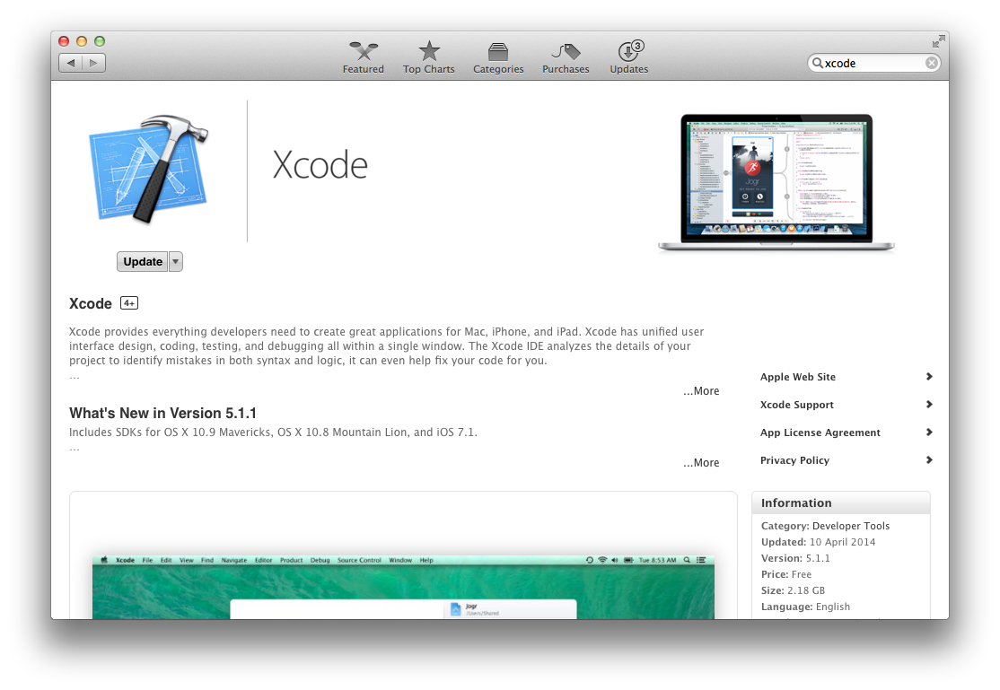
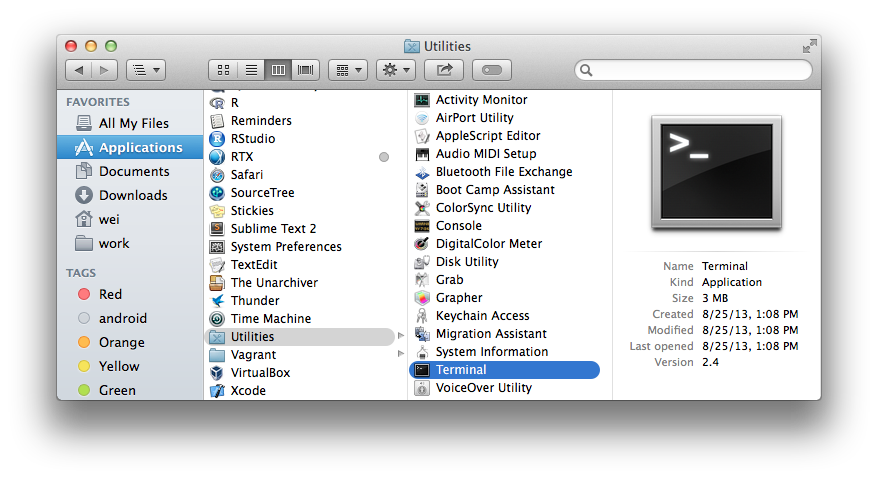
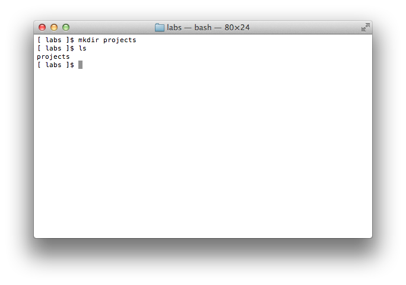
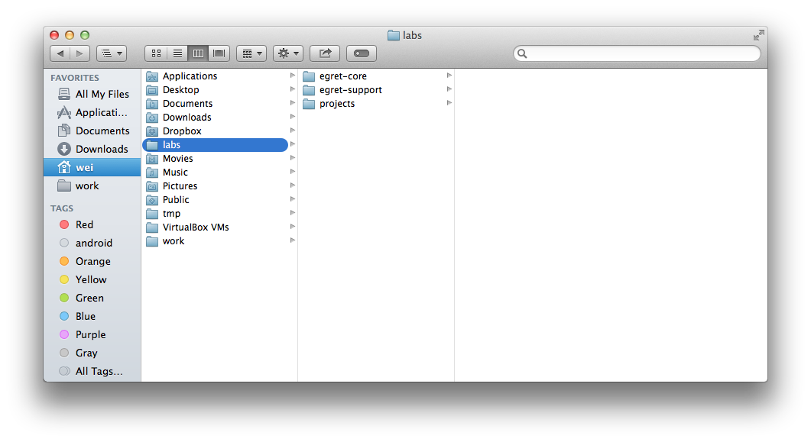
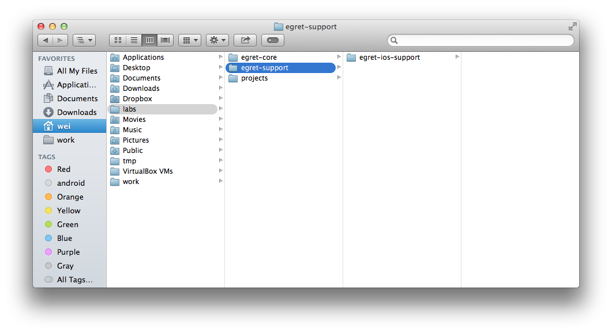
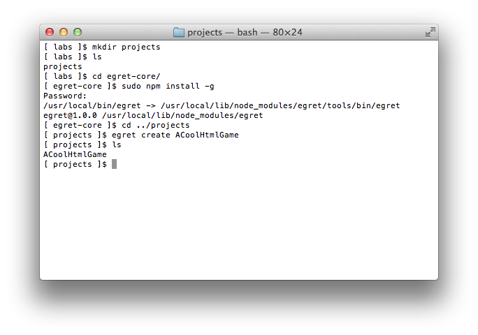
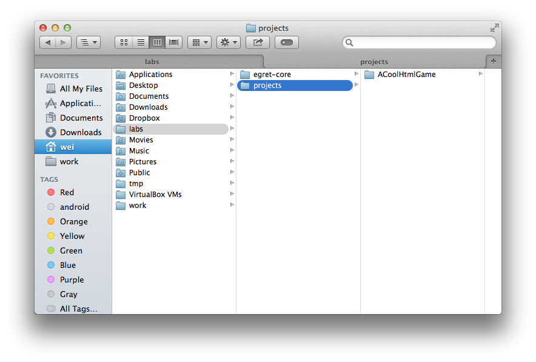
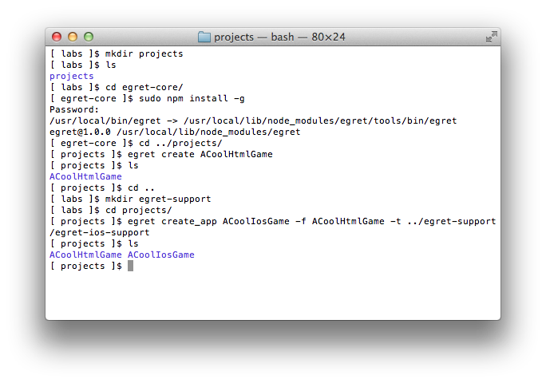
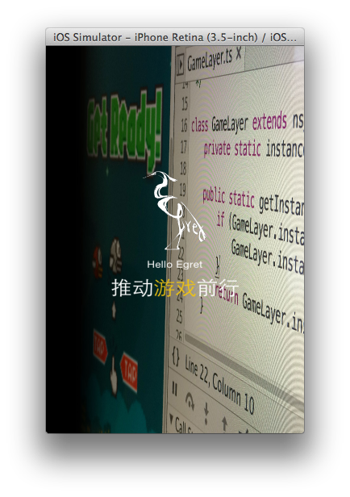

Egret-ios-support is a solution that helps a game packaged as a native ios APP. You can use egret-ios-support to package your HTML5 game as an ipa file and present it to the user for installation.

The specific usage is as follows：

## Propaedeutics

In order to complete this tutorial, make sure you have mastered the following：

* Understand the concepts of files, folders, and create, move, copy, rename, and delete.

* Understanding one of the Terminal, Command line, Shell, and know how to start it, and to complete the previous related operations through the command line execution of the way.

* Know how to download and extract files.

* Understand the following terms：

    * Writing a game logic：JavaScript、TypeScript、nodejs、npm

    * Packaged as an iOS App：Objective-C、C++、Xcode

> Please read this before reading this article. [Get Started](../../../Engine2D/getStarted/helloWorld/README.md)

## Document Overview

This article fully shows you the whole process of how to install Egret core packages and EgretiOS support packages in an environment where NPM management packages are already installed, and finally let the demo runs in the simulator.

This article is divided into three parts: the first part is the installation of iOS development environment, the second part is the installation of Egret game framework, and the third part is an example of creating a complete iOS App.

## The installation of iOS development environment

### Install the iOS development environment -- Xcode

Run App Store, look up "Xcode" in the search term, download and install it.



## The installation of Egret game framework

### Propaedeutics

Run the Terimal app of Mac OS X: open the Applications folder in Finder, then open the Utilities folder, find the Termial app and double-click to run it. As shown below:



Enter your working directory, in the demo, our working directory is "LABS/", which is an empty folder, as shown below:


Then, create a project folder for our game and run it

```
$ mkdir projects
```

As shown below：




### Install Egret

Portal：[Install the latest Egret under Mac OS X](../../../Engine2D/projectConfig/installation/README.md)。

### Download Egret-iOS-support

Create Egret Support folders



*Download Egret-ios-support package*

Download[egret-ios-support](http://www.egret.com/downloads/ios.html)，Put egret-ios-support under the "LABS /egret-support/" folder, as shown below:



## Create an example of iOS packaging

### Create an Egret project

Create a project named ` ACoolHtmlGame `, using the following command:

```
$ egret create ACoolHtmlGame
```

As shown：






### Writing your game project

The next thing to do is to write your game project logic. We won't do anything here, but use the default project for the demonstration.

### Create your ios project

#### Create an ios project from your HTML5 games

Going back to our game engineering folder, LABS /projects/, we can create a project for iOS with a new command that requires you to specify your egret-ios-support path and the original HTML5 project. The command is as follows:

```
$ cd projects/
$ egret create_app ACoolIosGame -f ACoolHtmlGame -t ../egret-support/egret-ios-support
```

>`create_app`The command can be used to create a project for iOS.`ACoolIosGame`The name of the project.

`-f`Parameter, specify our HTML5 game project, we will directly create the HTML5 project path to fill in.

`-t`Parameter, is the template of ios project, we need to specify "egret-ios-support" project path.

The following figure illustrates the run command:



After running the command, you will see the newly generated ACooliosGame project folder. The folder structure is as follows:


Since then, we've created a complete ios project, so let's take a look at the current file hierarchy:

```
labs/-+
      +-- egret-core/-+                         # egret
      +-- egret-support/-+                      # egret support library
      |                  +-- egret-ios-support/ # iossupport
      +-- projects/-+
      |             +-- ACoolIosGame            # iosproject
      |             +-- ACoolHtmlGame           # htmlapplication
      ...
```

### Compiling iOS games

#### Import the project

Open the ACoolIosGame folder, double-click "acooliosgame.xcodeproj" and wait for Xcode to load.


### Test the project

Click the Run command of Xcode to directly run the iOS emulator.


The running effect is as shown below:



To generate the ipa package, please visit[Apple developer's website](http://developer.apple.com/)，register a developer account and read the settings.

At this point, you completed the whole process of implementing an iOS game application with Egret.

### The overall process of project development

The development method we recommended: develop in the original HTML5 game project, till development test is well done, and then compile it in iOS platform. Here is a demonstration of the process:

1、Create a HTML game：

`egret create ACoolHtmlGame`

2、Create corresponding iOS games

`egret create_app ACoolIosGame -f ACoolHtmlGame -t ../egret-support/egret-ios-support`

3、Game Testing in all Related Platforms

4、Developing a game in ACoolHtmlGame, after a small step of development, we're going to start compiling our game and testing it on the browser, which is using

`egret build ACoolHtmlGame --runtime native -e`

This line performs two tasks: 1. Compile TypeScript to JavaScript, 2. Synchronize the compiled files into the Xcode project. There are two points need to pay attention to: 1. The compiled project is *HTML5 project, 2. Do not change the location of the iOS project *, the setting of the project location will be given in the advanced tutorial, 3. HTML5 project will be invalid at this time. If you want to view HTML5 project, please use

`egret build ACoolHtmlGame -e`

to make the HTML5 project work, while the iOS project fails.

5、At this point, you can start the game service with egret startserver ACoolHtmlGame so that the browser can observe the implemented game logic.

6、Next, go back to the Xcode project of ACoolIosGame and use Xcode to clear, recompile, and debug the project .

7、Back to Step 4 and iterate.