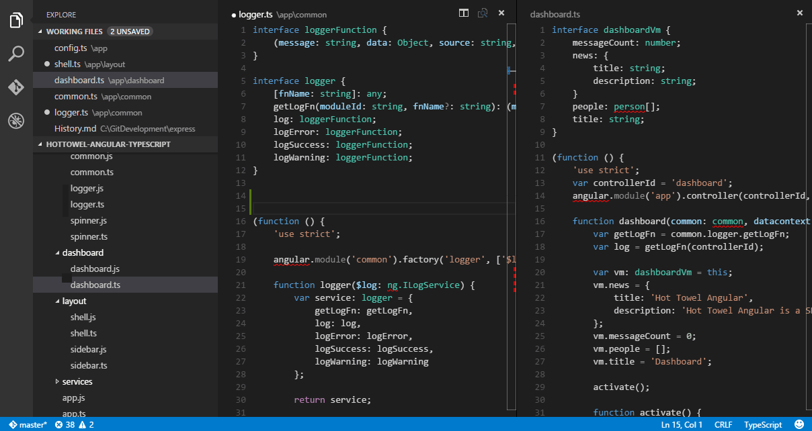

从根本上说，Wing 是一款代码编辑器，像其他编辑器一样，它左边有一个树状的文件管理器，方便查看正在编辑的项目或文件夹。右边是一个编辑器区域，显示你正在编辑文件的内容。

当然，Wing 也有许多不同于其他编辑器的优势，这篇文章将会一一的介绍这些功能。

## 文件，文件夹和项目
Wing 的编辑模式是基于文件或文件夹的，只要打开一个文件或文件夹就能立即使用 Wing 进行开发了。

在此之上，Wing 也能识别常用语言和框架的项目文件。比如，如果你用Wing打开了一个含有 `tsconfig.json`的文件夹，Wing 就会识别它，并为当前文件夹提供 TypeScript 智能提示支持。

## 基本布局
Wing 有着简单直观的布局，为代码编辑区保留了最大化的空间，同时也保留了足够的空间来浏览项目中的文件。Wing的UI主要分为下面的几大块：
- **编辑器** 编辑代码的主要区域，能够并排打开三个编辑器进行开发
- **侧边栏** 包含文件，搜索，Git和调试等功能面板
- **状态栏** 显示正在编辑的文件或文件夹额外的信息。
- **底边栏** 包含输出，控制台等等常用的面板。

每次打开Wing的时候，它会自动还原到你上次关闭它的状态，包括打开的文件夹，各个面板的布局以及上次打开的文件。

不同于以往编辑器，Wing 没有采用标签页(tabs)来管理打开的文件，在Wing中你能都同时并列打开三个编辑器。

这有助于减少大量标签页叠加造成的不便，而且并不会减少你同时打开文件的数量，在“文件”面板中维护者你当前正在编辑的文件的列表，你能很方便的找到你需要的文档。

## 多编辑器编辑
可以同时打开3个并排显示的编辑器。

如果有一个正在显示的编辑器，有几种方式来打开一个并排显示的编辑器。
- 在文件列表中，按住`Ctrl`(Mac:`Cmd`)点击一个文件
- 在文件列表中，右击一个文件，点击“在侧边编辑器打开”
- 按快捷键 `Ctrl+\` 在新编辑器中打开正在编辑的文档

注意，不论何时打开一个文件，当前活动的编辑器总是会显示新打开的文件的内容，所以，想要在特定的编辑器中打开文件时，请先点击一下它，来激活这个编辑器。

当同时打开了多个编辑器窗口的时候，可以通过按 `Ctrl/Cmd` + `1`,`2`或`3`来切换到您需要的编辑器。
> 可以通过拖动编辑器的标题栏，来重新排列几个编辑器的顺序，通过编辑器间的分隔线来调整每个编辑器的大小

## 文件管理器

“文件”面板可以用来浏览、打开、管理项目中的文件和文件夹。

在 Wing 中打开了一个文件夹的时候，该文件夹中所有的内容会显示在“文件”面板中。在这里可以进行各种文件操作：
- 创建、删除文件或文件夹，或者重命名。
- 通过拖动来移动文件或文件夹
- 使用右键菜单来查看所有的操作

> 可以直接从文件系统拖动文件到文件面板来复制到当前目录

