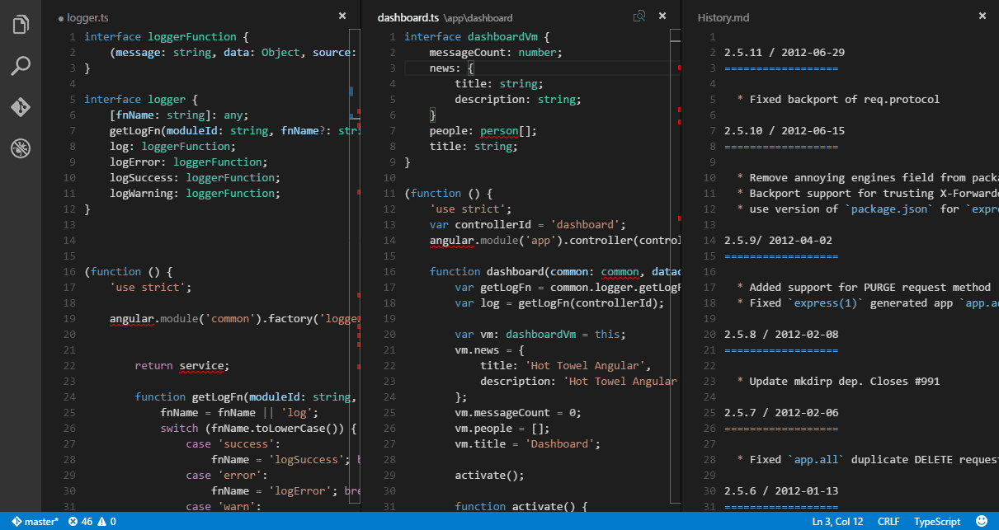
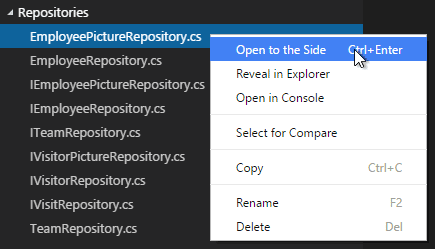

Basically, Wing is a code editor. Just like any other editors, it has a tree-shape file manager on the left, which makes it easy to view the project or folder being edited.The right side is an editor area that shows the contents of the file you are editing.

Of course, Wing also has many advantages different from other editors, which will be introduced in this article.

## Files, folders and projects
Wing's edit mode is based on the file or folder. As long as a file or folder is opened, development can be implemented immediately with Wing.

On top of this, Wing also recognizes project files of commonly used languages and frameworks.For example, if you open a folder containing `tsconfig.json` with Wing, Wing will recognize it and provide TypeScript smart prompt support for the current folder.

## Basic layout
Wing has a simple and intuitive layout, which retain both the maximum space for the code editing area and enough space for browsing the files in the project.Wing's UI is mainly divided into the following blocks:
- **The editor** edits the main area of the code and is capable of opening three editors side by side for development
- **The sidebar** contains function panels such as files, search, Git, and debugging
- **The status bar** displays the additional information about the file or folder being edited.
- **The bottom bar** contains the common panels such as output, console and so on.

Every time you open Wing, it will automatically restore to the status of the last time you closed it, including the open folder, the layout of each panel and the open files of last time.

Unlike the previous editor, Wing does not use tabs to manage open files. In Wing you can open three editors side by side at the same time.

This helps reduce the inconvenience caused by the large number of tab overlaps and does not reduce the number of files you can open at the same time. In the "File" panel you maintain the list of files you are currently editing, so you can easily find the document you need.

## Multiple editor edits
You can open three editors concurrently displayed side by side at the same time.

If there is an editor that is being displayed, there are several ways to open a editor displayed side-by-side.
- In the list of files, hold down `Ctrl` (Mac: `Cmd`) and click on a file
- In the list of files, right-click on a file, click "Open in the side editor"
- Press the shortcut key `Ctrl+\` in the new editor to open the document being edited

Note that whenever you open a file, the currently active editor always displays the contents of the newly opened file. Therefore, when you want to open the file in a specific editor, click on it to activate the editor.

When multiple editor windows are opened at the same time, you can switch to the editor you want by pressing `Ctrl/Cmd` + `1`, `2` or `3`.
> You can rearrange the order of several editors by dragging the editor's title bar to adjust the size of each editor by using the separation lines between editors

## File manager

The "File" panel can be used to browse, open and manage files and folders in a project.

When you open a folder in Wing, all the contents of that folder will be displayed in the "File" panel.Here you can do a variety of file operations:
- Create, delete files or folders, or rename them.
- Move file or folder by dragging it
- View all the operations by right clicking on the menu

> You can copy the file to the current directory by directly dragging it from the file system to the file panel 

