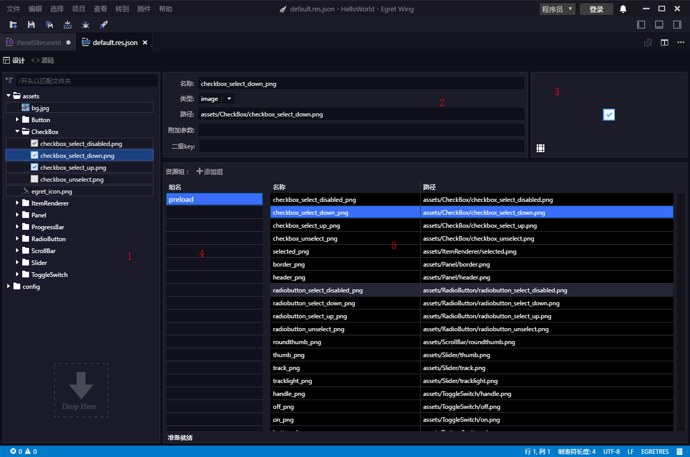
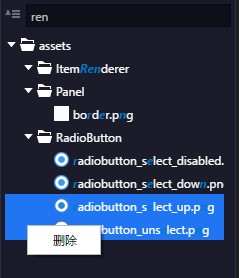
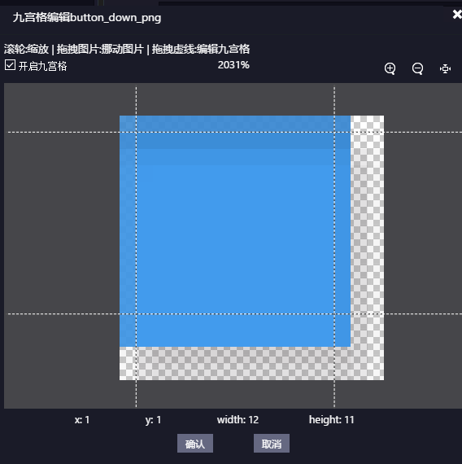
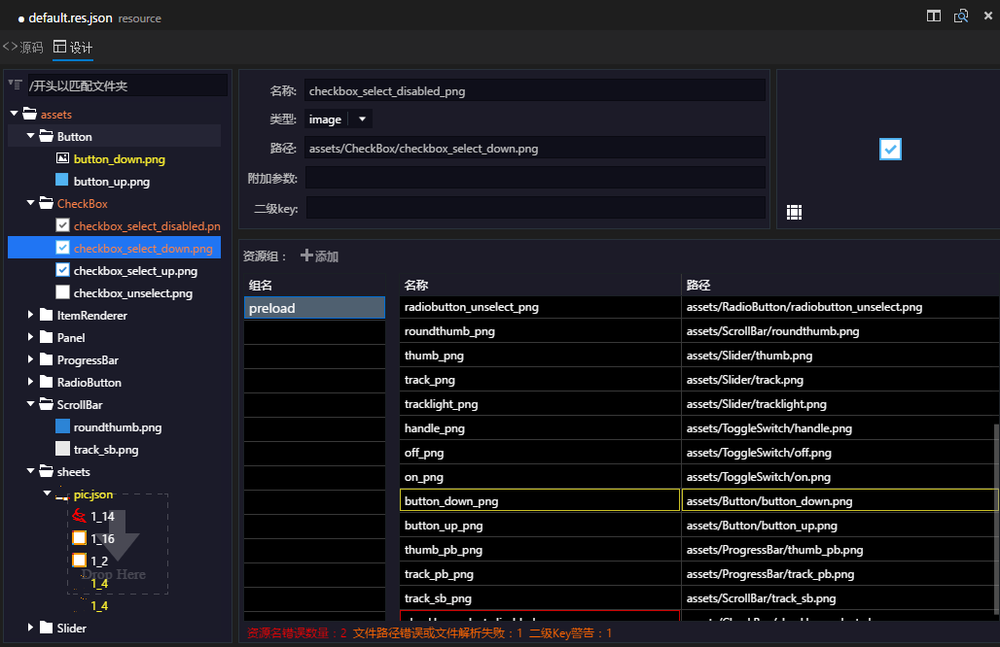

## Introduction
The [resource configuration file] (../../../extension/RES/loadConfig/README.md) used in the egret project is a file of json format. The resource configuration file can be edited with any text editor, providing a visual editing method in the wing. Such visual editing provides a more convenient operation, capable of automatically checking the errors in the configuration file and operating in batches, etc.

## Introduction to features
Open default.res.json to display the following interface:

The above is the design view interface. You can switch to the text editor interface by clicking on the source code.
The design interface is roughly divided into the following areas, corresponding to the figures above:
* 1 resource tree area
* 2 resource information area
* 3 resource preview area
* 4 group information
* 5 resources within the group

### **1. Resource tree area**
Here the resource file content is shown in the form of tree.The upper left corner of the tree has a function button for folding/expanding the tree, and the search box (using a fuzzy match). The search effect is as follows:

Select an item in the information area and preview area to display the selected resources.
Right click to delete the resource.
The resources can be deleted in batches. You can select multiple items while holding down the ctrl/command/shift at the same time. 
You can delete a folder.
Deleting a resource is automatically deleted from the associated group.
You can drag the image from the local file system and other resources to the resource tree, dragged into the file automatically added to the resource configuration.
Support for dragging files/folders.
If the dragged resource file is not in the current project resource directory, it will be automatically copied to the current project resource catalog under the assets directory.
### **2. Information area**
Here are the details of the selected resources, mainly 'resource name', 'resource type', 'relative resource path in configuration', 'additional parameters', 'secondary key' subkeys) 'and so on.
The resource name can be edited here.
You can modify the type of resource item.
You can refresh the secondary key.

### **3. Preview area**
Here is a variety of resources preview effect, of which image type is displayed as image, sheet file as a whole picture, bitmap font as  bitmap text.
For the resources of image type, there is a 9-thumbnail editing button, which can open the 9 thumbnail editing interface:

The 9-thumbnail data of the resources will be written in the resource file after the editing is completed.
### **4. Resource group**
This shows the grouping of the resource files.
Click the 'Add' button to add a new resource group.
You can choose to delete groups by right clicking on the menu
More than one can be chosen.
Can be deleted in bulk.
### **5. Resources within the group**
This shows the resources in the currently selected group.Selecting an item will display the details of the resource in the preview area of the information area and locate the resource in the resource tree.
You can choose to delete items by right clicking on the menu.
More than one can be chosen.
Can be deleted in bulk.
You can change the name by double-clicking.
You can drag resources from the local file system to the current zone.Support the operation of dragging files / folders.
If the dragged resources are not in the current project's resource directory, they are automatically copied to the assets under the current project resource directory.
You can drag resources from the resource tree to the current zone and add them automatically to the current group.

## Resource conflict
If the resource file has a re-name resource item, or the corresponding file does not exist or there is other errors, it will automatically detect and remind by the means of marking red or yellow box.At the bottom of the interface there will be prompt text.

The figure above shows three types of errors:
The button_down.png file has just been deleted. The file corresponding to the resource does not exist and is displayed in yellow.
* In checkbox, the resource name of checkbox_select_down.png is changed to checkbox_select_disabled_png, which is in conflict with the resource name in the checkbox_select_disabled.png. When resource name is duplicated, it will be displayed in red.
*The the subkey in the form file pic.json has one name duplication, which is shown in yellow.

## Other
After the resource is edited, you need to save by pressing ctrl+s.

The resource editor is based on the wing project and needs to read the resource configuration from the project's configuration file wingProperties.json. Open wingProperties.json, add your own resource file under resourcePlugin-> configs:

