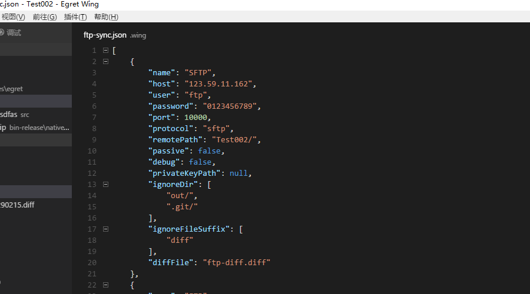
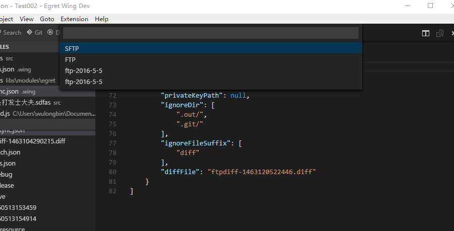
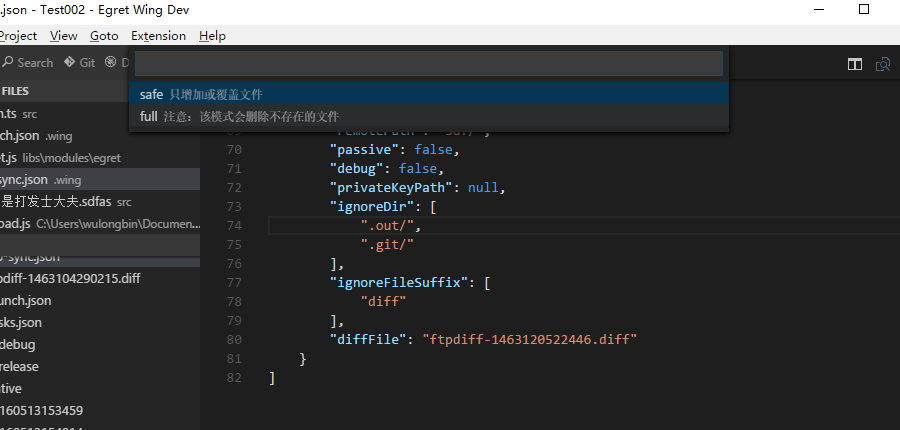
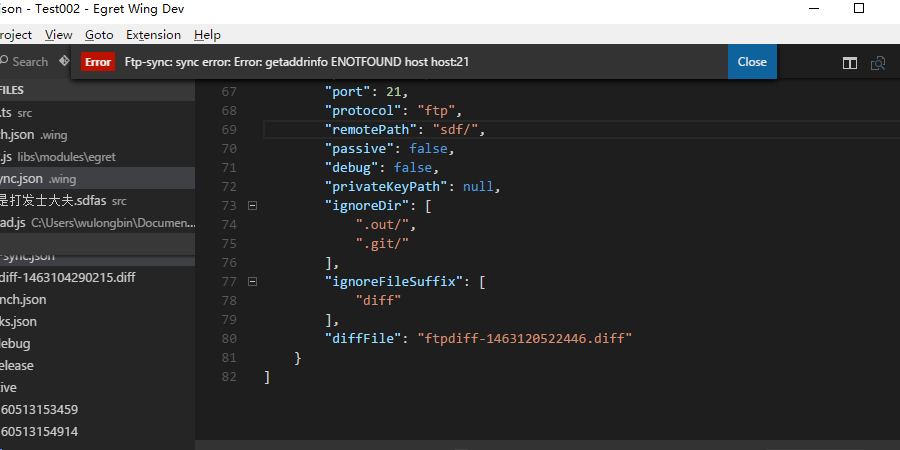

## Support the following functions

- Support ftp and sftp protocol to upload project files
- Support the configuration of different ftp configuration, on-demand upload
- Support to manually select the file directory to upload files
- Support differential upload files, and reduce unnecessary uploads

## Add practical introduction to ftp configuration 
- First open a project file (if the workspace has no project, you can not use the ftp function)
- Select the Menu -> Plugin -> FTP-> Add FTP server configuration, then in the pop-up interface, enter the necessary information of ftp configuration. After clicking OK, file ftp-sync.json file can be created under .wing file. More detailed configuration can be directly modified and take effect in the file.

## Introduction to valid attributes in ftp configuration
- name: ftp configuration name
- host: ftp server address
- user: ftp username
- password: ftp user password
- port: ftp protocol port
- protocol: ftp protocol, support ftp and sftp protocols.
- remotePath: upload the target path to the server
- privateKeyPath: Local private key path for the sftp protocol
- ignoreDir: Ignore the file directory name (as long as the file directory name matches it, all files in the file directory will be ignored.)  
- ignoreFileSuffix: Ignore files by suffix name
- diffFile: difference file

## The project is published and uploaded to the FTP server usage introduction

- First, open a project file (if the workspace has no project, you can not use the ftp function)
- Select the Menu -> Plug -> FTP -> Upload to the FTP server (If there is no ftp configuration, it will pop up to add FTP configuration window). After the completion of the publishing, it will inquire which ftp server the upload will be made for according to the configuration.

- After selecting the ftp server, the next step is to upload the security mode. There are two types: safe mode. To add and overwrite the server file, there will be no deletion operation; full mode. There will be deletion of operation file.

- Finally, wait for the completion of upload. If the configuration  error and other reasons lead to connection failure, relevant error messages will pop up after 10 seconds.

- If you can see the prompt of successful upload, it indicates that the ftp upload is successful.