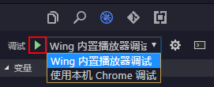

When you need to run or debug the current project, you need to set the startup configuration.Similar to the task configuration, the startup configuration is saved in `.wing/launch.json` under the current workspace.
By default, you can use the shortcut keys F5, ** to start or debug ** the current project.You can also switch the left side of the column to the Debug tab, select a startup configuration in the drop down box and then click Run.



If there is no `launch.json` in the current workspace, use F5 to display the box to select the startup configuration template.


For the general Egret projects, the startup configuration that matches the Egret project has been automatically generated when the project was created: It includes various configurations, such debugging through built-in player and debugging through Chrome, so as to easily debug and launch the Egret project.`launch.json` is as follows:

```
{
	"version": "0.2.0",
	"configurations": [
		
		{
			"name": "Wing 内置播放器调试",
			"type": "chrome",
			"request": "launch",
			"file": "index.html",
			"runtimeExecutable": "${execPath}",
			"useBuildInServer": true,
			"sourceMaps": true,
			"webRoot": "${workspaceRoot}",
			"preLaunchTask":"build",
			"port":5892
		},
		{
			"name": "使用本机 Chrome 调试",
			"type": "chrome",
			"request": "launch",
			"file": "index.html",
			"useBuildInServer": true,
			"sourceMaps": true,
			"webRoot": "${workspaceRoot}",
			"preLaunchTask":"build",
			"userDataDir":"${tmpdir}",
			"port":5892
		}
	]
}
```

> Generally, custom EgretWing is to modify the contents of a json file.As this kind of manual modification is a little difficult for some beginners, we are currently planning to allow more people easily customize EgretWing with custom configuration file visualization .

