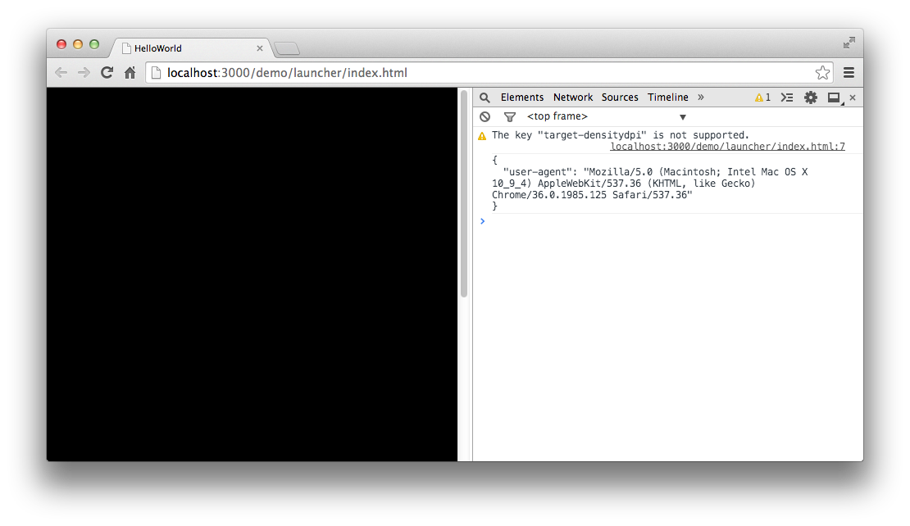

Egret encapsulates the network portion and separates the network access request from the network communication data. In the "net" folder, five classes related to the network are defined.They are `URLRequest`, Are `URLRequest`, `URLLoader`, `URLLoaderDataFormat`, `URLRequestMethod` and `URLVariables` respectively. 

When creating a network connection, you need to create a `URLLoader` object, which is responsible for the connection state operation of the network and is responsible for receiving data from the network. When the network is communicating, the network communication data is managed by the `URLRequest` object. 

Creating a simplest communication request requires the use of two classes, `URLLoader` and `URLRequest` respectively. 

```
private urlloader:egret.URLLoader;

this.urlloader = new egret.URLLoader();
```

In the `urlloader`, the network communication can be operated. For example, to begin loading data, detect the progress of data loading or if data loading is completed.

When data is being loaded, you need to enter the communication address, which is usually the URL or server background address.To add a network address, you need the `URLRequest` object. Take the "http://httpbin.org/user-agent" test address as an example.The code is as follows:

```
var urlreq:egret.URLRequest = new egret.URLRequest();

urlreq.url = ;
```

The above code creates an object of `URLRequest` type, and assigns the test address to the attribute named` url`. 

The way to load the data is `load`, which needs to pass the` URLRequest` object that you just created as a parameter.

```
this.urlloader.load( urlreq );
```

At this point, the compilation operation won't see any effect, because there is no state of network communication for any monitoring or response processing.Continue adding code to monitor the `COMPLETE` events loaded by the network.When the network load is completed, the corresponding function will be called.

```
this.urlloader.addEventListener(egret.Event.COMPLETE, this.onComplete, this);
private onComplete(event:egret.Event):void
{
    console.log( this.urlloader.data );
}
```

In the event response function, the acquired data is exported to the JavaScript console.

The above contents are as follows:

```
class NetDemo extends egret.DisplayObjectContainer
{
    public constructor()
    {
        super();
        this.addEventListener(egret.Event.ADDED_TO_STAGE,this.onAddToStage,this);
    }
    private urlloader:egret.URLLoader;
    private onAddToStage(event:egret.Event)
    {
        this.urlloader = new egret.URLLoader();
        var urlreq:egret.URLRequest = new egret.URLRequest();
        urlreq.url = "http://httpbin.org/user-agent";	;
        this.urlloader.load( urlreq );
        this.urlloader.addEventListener(egret.Event.COMPLETE, this.onComplete, this);
    }
    private onComplete(event:egret.Event):void
    {
        console.log( this.urlloader.data );
    }
}
```

Compile and run, with the effect shown as below:

