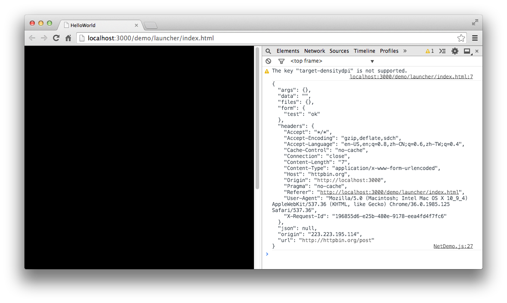

If you need to submit data at the time of network request, you need to use `URLVariables`.

With the `URLVariables` class, variables can be transferred between the application and the server. Use the `URLVariables` object, together with the `URLLoader` class method, the `data` attribute of the `URLRequest` class.

In general, submitting data to the server actually contains two steps, namely, submitting data and reading the returned information.

1. The submitted data is placed in the `data` attribute value of the `URLRequest` object and submitted via the `URLRequest` object.

2. Read the data returned by the server-side script.

The specific sample code is as follows:

```
class NetDemo extends egret.DisplayObjectContainer
{
    public constructor()
    {
        super();
        this.addEventListener(egret.Event.ADDED_TO_STAGE,this.onAddToStage,this);
    }
    private onAddToStage(event:egret.Event)
    {
        var url:string = "http://httpbin.org/post";
        var loader:egret.URLLoader = new egret.URLLoader();
        loader.addEventListener(egret.Event.COMPLETE, this.onPostComplete, this);
        var request:egret.URLRequest = new egret.URLRequest(url);
        request.method = egret.URLRequestMethod.POST;
        request.data = new egret.URLVariables("test=ok");
        loader.load(request);
    }
    private onPostComplete(event:egret.Event):void
    {
        var loader:egret.URLLoader = <egret.URLLoader> event.target;
        var data:egret.URLVariables = loader.data;
        console.log( data.toString() );
    }
}
```

Run after compilation, with the effect shown as below:

