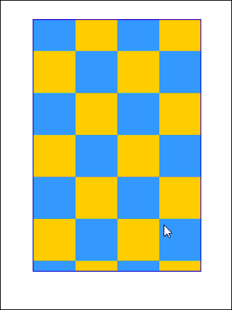
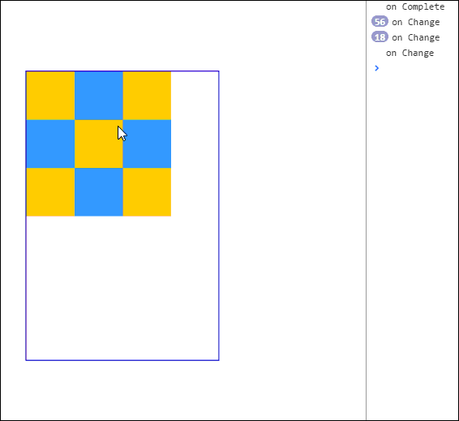

ScrollView is a scrolling view. By opening a scroll window, you can add the displayed contents, and the content can be slidden up and down, left and right in this window of fixed size.Similar to other display objects, ScrollView can't be displayed until it has been added to the display list.Here's how to use ScrollView and demonstrate its performance.

> The `egret.ScrollView` class is located in the `game` library. If it is used, make sure that the `game` library is referenced in the project.For the method operation, please refer to: [Modular configuration and usage of third-party libraries] (../../../extension/threes/instructions/README.md)

## 1. Create a scrolling view

The method of creating a `ScrollView` instance is as follows:
```
var myscrollView:egret.ScrollView = new egret.ScrollView();
```
Here to create an empty `myscrollView`, and add a scrolling display of "content" code to the 'ScrollView', which is as follows:
```
myscrollView.setContent (The content display object);
```
If you do not set the width and height of the scroll view, the width and height of `myscrollView` will be supported by the contents and the effect of scrolling can not be seen.So it is generally necessary to manually set the width and height of the scrolling view:
```
myscrollView.width = width;
myscrollView.height = height;
```
Finally add the `myscrollView` display object to the display list:
```
Container .addChild (myscrollView);
```
It is not required to add to the display list. It is fine to just place it into the `ScorllView`.

## 2. Other settings of ScrollView

The complete code of the above program is as follows:
```
class ScrollViewDemo extends egret.DisplayObjectContainer {

    public constructor () {

        super();
        this.once(egret.Event.ADDED_TO_STAGE,this.onAddToStage,this);

    }
    private  onAddToStage () {
        //create content, side length 50 * 50 grid 9 * 9.
        var content:egret.Shape = this.createGird(50,50,9,9);
        //Create ScrollView
        var myscrollView:egret.ScrollView = new egret.ScrollView();
        myscrollView.setContent(content);
        myscrollView.width = 200;
        myscrollView.height = 300;
        myscrollView.x = this.stage.stageWidth / 2;
        myscrollView.y = this.stage.stageHeight / 2;
        myscrollView.anchorOffsetX = myscrollView.width / 2;
        myscrollView.anchorOffsetY = myscrollView.height / 2;
        this.addChild(myscrollView);
        //background image, which is used to show the boundaries of ScrollView
         var background:egret.Shape = new egret.Shape();
        background.graphics.lineStyle(1,0x1102cc)
        background.graphics.drawRect(0,0,200,300);
        background.graphics.endFill();
        background.x = this.stage.stageWidth / 2;
        background.y = this.stage.stageHeight / 2;
        background.anchorOffsetX = background.width / 2;
        background.anchorOffsetY = background.height / 2;
        this.addChild(background);
    }
    //Create a grid function by creating a grid chart of row * lines based on the width and height of the input.And returns the Shape object.
    private createGird(w:number,h:number,row:number,line:number):egret.Shape {

        var shape:egret.Shape = new egret.Shape();
        for(var i = 0;i < row;i++ ) {
            for(var j = 0; j < line;j++) {
                if ((j + row * i) % 2 === 0) {
                    shape.graphics.beginFill(0xF9C20B);
                    shape.graphics.drawRect(j * w, i * h, w, h);
                    shape.graphics.endFill();
                }
                else {
                    shape.graphics.beginFill(0x2A9FFF);
                    shape.graphics.drawRect(j * w, i * h, w, h);
                    shape.graphics.endFill();
               }
            }
        }
        return shape;
    }

}
```

Create a 9 * 9 graphics consisting of a 50 * 50 grid to simulate the contents of the ScrollView.And then create a `ScrollVeiw`, and put it into the middle of the screen which is set with the width and height of 200 * 300, so the area of its content is larger than the `ScollView` area, in which the effect of rolling can be seen.Finally add a border with the same size as `ScrollView` to display the boundaries of `ScollView`.You can see the following effects:



### 2.1. Enable bounces

Whether the `bounces` of `ScrollView` is enabled or not. When the bounces is enabled, the contents in the ScrollView are allowed to be continually dragged after reaching the boundary, and will bounce back to the border position after the user has dragged the operation.
By default, bounces is enabled. Next please view the effect by closing the bounces.
Please insert after the line of `this.addChild (myscrollView);` in the above code
```
myscrollView.bounces = false;
```


2.2. Scroll policy

`ScrollView` can set two scroll policies, namely, horizontalScrollPolicy and verticalScrollPolicy respectively.Each of them has three specific values, namely, `on`,` off` and `auto`. By default it is `auto`.
It can't be dragged until it is wider than ScrollView.Specifically, you can see the following code. We first reduce the grid, modify its width, and then set the ScrollView's horizontal scroll policy as `auto`, vertical scroll policy as `on`, so as to see the results.
Modifying the code of `content` is as follows, with the grid being 3*3: 
```
//create content, 3 * 3 grid with side length of 50 * 50.
var content:egret.Shape = this.createGird(50,50,3,3);
```
Please insert after the line of `this.addChild (myscrollView);` in the above code
```
//vertical scrolling is set to on 
myscrollView.verticalScrollPolicy = "on";	;
//horizontal scrolling is set to auto
myscrollView.horizontalScrollPolicy = "auto";	;
```


You can see that it can only scroll in the vertical direction, but not in the horizontal direction.

### 2.3. Monitor events

The `egret.Event.CHANGE` event will be thrown when the contents of` ScrollView' is dragged.After dragging is completed for one time, `egret.Event.COMPLETE` will be thrown before next time begins. Continue to add the following code:
```
myscrollView.addEventListener(egret.Event.COMPLETE,this.onComplete,this);
myscrollView.addEventListener(egret.Event.CHANGE,this.onChange,this);
```
And add a listener function to the `ScrollViewDemo` class:
```
private onComplete(event:egret.Event) {
    console.log("on Complete")	)
}
private onChange(event:egret.Event){
    console.log("on Change");	);
}
```
You can see the following effects:


For other effects, please refer to API: [ScrollView] (http://developer.egret.com/cn/apidoc/index/name/egret.ScrollView)